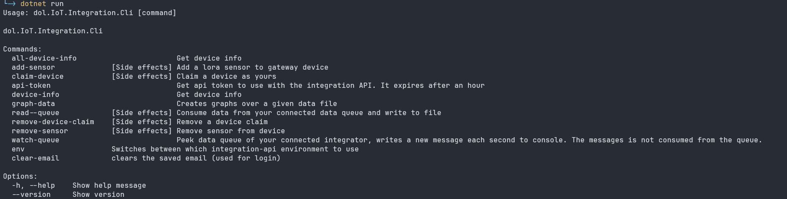
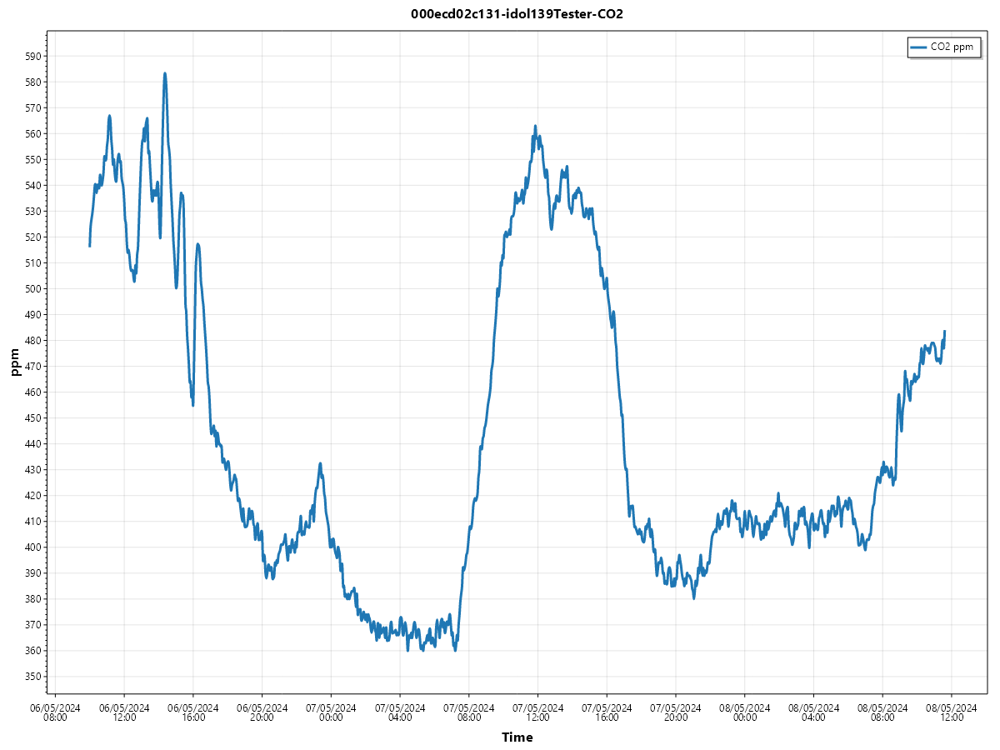

## Introduction

This project is an example of how to communicate with dol-sensors iot integration API.
For a general introduction on the API see `Integrator API getting started.md`.

This cli program doesn't work if you don't have an `integrator account` in the API - see the getting started doc. 

## Getting started with this project

You need the dotnet 8 sdk installed in order to build and run this project. https://dotnet.microsoft.com/en-us/download/dotnet/8.0

By just running the project you will get the following information


This is the list of commands available. 
These commands are all found in the commands folder (src/dol.IoT.Integration.Cli/commands/..).
In order to be authenticated and authorized to talk to the api, you will be asked for an email and password corresponding to a login you have created for your integrator account.
This is handled in the LoginHandler.cs and LoginService.cs files. 

Each command will either talk directly to the http API or will listen to one of the integrator queues that data and status messages from the devices are routed to. 

## Running commands

To run a command just write the command name after `dotnet run -- `.
The -- is needed so the arguments added with -flags is passed along to this program and not the dotnet sdk.
To see what a command expects, run the command with the -h flag.  
Example 

```
> dotnet run -- claim-device -h


Usage: dol.IoT.Integration.Cli claim-device [--mac <String>] [--key <String>] [--device-type <String>] [--device-name <String>] [--owner <String>] [--help]

[Side effects] Claim a device as yours

Options:
  -m, --mac <String>            device mac address
  -k, --key <String>            key
  -t, --device-type <String>    device type
  -n, --device-name <String>    device name
  -o, --owner <String>          owner
  -h, --help                    Show help message
```

You can also build the project and run the dll/exe file directly (then you wont need the extra `--`)


## Environment 
You can swap between QA and Production environments with the `env` command. Qa and production uses different logins, so you will be asked to input your email and password again after a change in env.

## Reading data from queues

There is a couple examples on how to read data from the service bus queue. 

The `watch-queue` only watches the messages in the queue. So no messages will be consumed from the queue running this command. 

The `read-queue` command will consume the messages it receives (meaning they will be marked as completed in the queue and deleted). This command wil save the received messages in either a .csv or .json file depending on the arguments.

After you have run `read-queue` you will have a file containing all the received data. Using that data file you can run the `graph-data` command which will create a new graph for each sensor and measurement type found in the data file.

Example: 

```
> dotnet run -- read-queue data.csv
Reading from service bus queue my-test-integrator-data, saving data to csv file data.csv
Received data x33
Received data x33
Received data x32
Received data x66
Received data x34
Received data x10
data export done
```
I now have a file called data.csv containing all the measurements from the queue.

```
> dotnet run -- graph-data data.csv

```
This creates a number of new .png files containing a graph of the measurements, split by sensor and again by measurement type.  
Example:  
