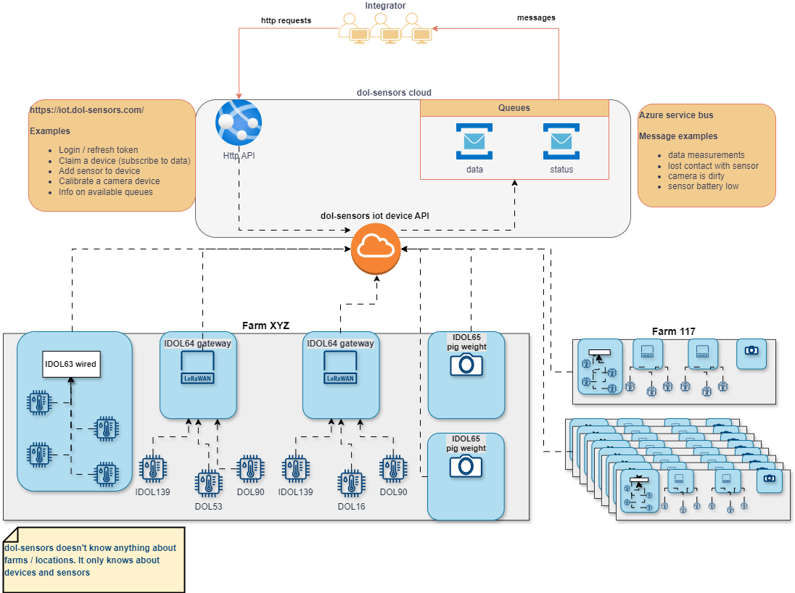

# Getting started with dol-sensors IoT integration 

 
# High level concepts

The dol-sensors integration is split in two parts.
- Http API
- Service bus queue subscriptions 



## Http API

The http API is where you register new devices, configure and update them and tell devices to run certain commands. All this is initiated from your side, either by the end-user or by your overall system. 

All incoming data measurements and status from the registered devices is **NOT** found in the http API.

## Queues

All device data and status messages is placed in queues, from where you can read them as they arrive. This includes both the measurements from devices, as well as any updates to the status of the devices. 

## Integrators

In order to integrate to dol-sensors iot devices, you need an integrator account.
This in turn gives you access to the HTTP API and the data and status queues that contains the live data from devices.

You only need one integrator account, not one for each user you have. The integrator account is *you (or more correctly your system)*.
The individual end-users that exists in your software / UI is not represented in the dol-sensors api. 

## Logins

To communicate with the API, you need a login. 
- A login is attached to an Integrator account. 
- An integrator account can have multiple logins. 

The login is the way you are authorized to perform actions on the API "on behalf of" the integrator account.

## Device

Devices are the actual IoT devices sold by dol-sensors. 

### IDOL64 - wireless gateway

The IDOL64 is a wireless gateway for LoRa enabled sensors.
This device will handle the wireless communication with the different LoRa sensors.  
It is the different sensors that performs the measurements (temperature, co2, humidity, ammonia, etc..)

Besides the up to 50 wireless sensors, the IDOL64 also allows 4 wired sensors to be connected. 

### IDOL65 - pig weighing camera

The IDOL65 device is camera mounted above a pig pen that will measure the pig's weight. In contrast to the IDOL64 device, the camera does not have any additional sensors.  

## Sensors

Sensors are what actually makes the different measurements. Typically these sensors does not have an internet connection, and thus it has no way of delivering measurements to the cloud. 
Instead they talk to a gateway device like IDOL64 that will upload the data measurements for the sensor. 

Examples of sensors:
- DOL 16  - Light sensor (measurements in LUX)
- DOL 53 - Ammonia Sensor (measurements in NH3 - parts per million)
- IDOL 139 - Temperature, humidity and CO2 (3 different measurements, one sensor)  

# Quick start

For a nice interactive view of all the endpoints in swagger - [click here](https://iot.dol-sensors.com/swagger/index.html) or [here for test environment](https://dol-iot-api-qa.azurewebsites.net/swagger/index.html). 

## Integrators and logins

First, we need to register a new **login** to start using the API. 

`POST /api/auth/register` to register an account.
```json
{
  "email": "mic@dol-sensors.com",
  "password": "SomeLongPassword123!"
}
```

You will then receive an email where you can confirm that it is indeed your email.

Once a a login has been created, we can attach the login to an **integrator** account. 
**To create a new integrator and attach the login, a dol-sensors employee is required.** 

With our new login now attached to an integrator, we can start using the API.

`POST /api/auth/login` to receive a bearer token.
```json
{
  "email": "mic@dol-sensors.com",
  "password": "SomeLongPassword123!"
}
```

response looks like this

```json
{
  "tokenType": "Bearer",
  "accessToken": "............................",
  "expiresIn": 3600,
  "refreshToken": "............................"
}
```

To authenticate our requests we use the accessToken as a bearer token in our http request headers.

```curl 
curl --header 'Authorization: Bearer {accessToken}'
```

We can use this accessToken for one hour. After that it will expire.

To refresh the accessToken we use the `/api/auth/refresh` endpoint with our refresh token. With that, we receive a new accessToken (valid for another hour) and a new refreshToken.  

## Register new device (Claim device)

All endpoints (except auth) require login and that our login is attached to an integrator.
To register a new device, we "claim" it as ours. This means our integrator now "owns" this device. Data and status from the device will start being forwarded to the integrator queues. Without a claim on the devices most endpoints will return a failed request.

`POST /api/devices/claim`
```json
{
  "macAddress": "00abcd1234ef", // this is written on the actual physical device
  "key": "someKey", // also written on the device
  "deviceType": "IDOL64", // the type of dol-sensors device
  "owner": "Optional", // use this only if you want some identifying information about the device saved in dol-sensors system (like a customer id or similar)
  "deviceName": "Optional" // use this only if you want some identifying information about the device saved in dol-sensors system
}
```

After attempting to claim a device, here are the possible outcomes:

*   **✅ Success: `200 OK`**
    *   The device has been successfully claimed by your integrator account.

*   **❌ Error: `400 Bad Request`**
    *   **Message:** `"Cannot claim this device, key invalid"`
        *   **Meaning:** The device key you used is incorrect.
        *   **Action:** Double-check the key. If correct, please **contact support**.
    *   **Message:** `"Device has already been claimed"`
        *   **Meaning:** The device is already registered to another account.
        *   **Action:** Check your list of devices. If you don't see it, **contact support**.
*   **❌ Error: `401 Unauthorized`**
    *   **Message:** `""`
        *   **Meaning:** You are not logged in.
        *   **Action:** Try logging in again. If error persist, please **contact support**.

## View devices

To get an overview of all our (integrators) devices call

`GET /api/devices` 
```json
{
  "devices": [
    {
      "mac": "00abcd1234ef",
      "deviceName": "some name",
      "deviceType": "IDOL64",
      "createdAt": "2023-11-23T14:54:30Z"
    }
  ],
  "pageNumber": 1,
  "pageSize": 100,
  "deviceTotal": 1
}
```

Use the optional query parameters page and pageSize to manipulate paginated response of devices. 
Use the optional owner query parameter to filter devices by owner.

After attempting to get the list of devices, here are the possible outcomes:

*   **✅ Success: `200 OK`**
    *   The list of devices is succesfully retrieved, if empty means you haven't claimed any devices yet.

*   **❌ Error: `403 Bad Request`**
    *   **Message:** `""`
        *   **Meaning:** Your account is not yet an integrator.
        *   **Action:** Please **contact support**.
*   **❌ Error: `401 Unauthorized`**
    *   **Message:** `""`
        *   **Meaning:** You are not logged in.
        *   **Action:** Try logging in again. If error persist, please **contact support**.

`GET /api/devices/{mac}`
```json
{
  "mac": "00abcd1234ef",
  "key": "UvtLPSNd",
  "deviceType": "IDOL64",
  "owner": "optional owner", 
  "deviceName": "optional name", // will default to {deviceType}-{mac}
  "createdAt": "2023-11-23T14:54:30Z",
  "updatedAt": "2023-11-23T14:54:30Z",
  "connectionState": "Connected",
  "isOnline": true,
  "lastActivityUtc": "2024-03-15T10:28:49Z", 
  "cloudToDeviceMessages": 0,
  "sensors": [
    {
      "devEui": "a2..............",
      "name": "Pen 3",
      "createdAt": "2024-02-10T08:10:42Z",
      "latestDataSentAt": "2024-03-15T10:32:15Z",
      "sensorType": "iDOL139",
      "sampleRate": 180
    },
    {
      "devEui": "a3..............",
      "name": "Pen 6",
      "createdAt": "2024-02-10T08:12:42Z",
      "latestDataSentAt": "2024-03-15T10:32:38Z",
      "sensorType": "iDOL139",
      "sampleRate": 180
    },
    {
      "devEui": "a4..............",
      "name": "Outside 1",
      "createdAt": "2024-02-10T08:16:42Z",
      "latestDataSentAt": "2024-03-15T10:32:48Z",
      "sensorType": "iDOL139",
      "sampleRate": 180
    }
  ],
  "wiredSensors": null,
  "cameraStatus": null
}
```
After attempting to get the device, here are the possible outcomes:

*   **✅ Success: `200 OK`**
    *   The device is succesfully retrieved.

*   **❌ Error: `404 Not found`**
    *   **Message:** `"Could not find device x"`
        *   **Meaning:** The device is not claimed by your account.
        *   **Action:** Double-check if the device is claimed with your account. If correct, please **contact support**.
*   **❌ Error: `401 Unauthorized`**
    *   **Message:** `""`
        *   **Meaning:** You are not logged in.
        *   **Action:** Try logging in again. If error persist, please **contact support**.

The "sensors" array contains the configued wireless sensors, the "wiredSensors" contains the configured wired sensors.
For IDOL65 these will be null and instead the "cameraStatus" will be filled like so

```json
{
	"cameraDirty": "Clean",
    "manuallyCalibrated": false,
    "calibrationStatus": "Done",
    "dirtyDetectionEnabled": true,
    "lastCalibrationTime": "2024-03-14T13:29:54Z",
    "messages": [
	    {
	      "MessageId": 0,
	      "MessageText": "In-pen calibration successful ",
	      "MessagePayload": ""
	    }
    ]
  }
```

## Add new sensor to device

This operation is only supported by our IDOL64 variants.

To configure a new lora enabled sensor on our device we can call the following endpoint. 
This example is for a DOL53 - an ammonia sensor. 

`POST /api/devices/{mac}/sensor`
```json
{
  "devEUI": "..........", // found on label on the sensor
  "name": "string", // some identifying name so the sensor can easily be identified 
  "type": "DOL53",
  "sampleRate": 600, // the sensors sample rate in seconds
  "sensorDetailsRequest": { // all this is optional
    "productName": "Optional",
    "productionVersion": "Optional",
    "serialNumber": "Optional"
  }
}
```

After attempting to add a new sensor to the device, here are the possible outcomes:

*   **✅ Success: `200 OK`**
    *   The sensor is succesfully created.

*   **❌ Error: `400 Bad request`**
    *   **Message:** `"Cannot add sensor to device x"`
        *   **Meaning:** The device is not claimed by your account and/or the device is not an IDOL64.
        *   **Action:** Double-check if the device is claimed with your account and that is an IDOL64. If correct, please **contact support**.
    *   **Message:** `"Device has not been online yet"`
        *   **Meaning:** The device hasn't been online yet.
        *   **Action:** Try connecting the device. If the device is struggling to get online, please **contact support**.
    *   **Message:** `"Cannot add sensor x, y, the name or devEui is already in use on this gateway"`
        *   **Meaning:** The device already contains a sensor with the same name or DevEui.
        *   **Action:** Double check if the device has already that sensor, or the same name.
    *   **Message:** `"Device is not online, so cannot add sensor"`
        *   **Meaning:** The device is not connected to the internet.
        *   **Action:** Double check if the device has connection to the internet. If correct, please **contact support**.
    *   **Message:** `"unable to add sensor to device"`
        *   **Meaning:** API Error.
        *   **Action:** Try again. If the error persist, please **contact support** with the api error.      
*   **❌ Error: `401 Unauthorized`**
    *   **Message:** `""`
        *   **Meaning:** You are not logged in.
        *   **Action:** Try logging in again. If error persist, please **contact support**.


We can verify that the sensor has indeed been added to the device by calling the device information endpoint again. 
Verify by showing the device details from 

`GET /api/devices/00abcd1234ef`
```json
{
  "mac": "00abcd1234ef",
  "key": "UvtLPSNd",
  "deviceType": "IDOL64",
  "owner": "optional owner",
  "deviceName": "optional name", // will default to {deviceType}-{mac}
  "createdAt": "2023-11-23T14:54:30Z",
  "updatedAt": "2023-11-23T14:54:30Z",
  "connectionState": "Connected",
  "firmwareVersion": "2.2.0",
  "isOnline": true,
  "lastActivityUtc": "2023-11-25T14:17:43Z",
  "cloudToDeviceMessages": 0,
  "sensors": [{
      "devEui": "...........",
      "name": "dol53 outside",
      "createdAt": "2023-11-25T08:02:25Z",
      "sensorType": "DOL53",
      "sampleRate": 600,
      "batteryStatus": {
		"code": 0,
		"value": "OK"
      }
  }],
  "wiredSensors": []
}
```

## Add wired sensor to device

IDOL64 devices support up to 4 wired sensors to be connected. The device needs to know which sensors are wired to which port in order to read the data.
We can do this configuration with the following endpoint

`PUT /api/devices/{mac}/wiredSensor`
```json
{
  "sensors": [
    {
      "port": 1,
      "wiredSensorType": "DOL16",
      "samplingRate": 60,
	
    },
    {
      "port": 2,
      "wiredSensorType": "DOL139",
      "samplingRate": 60
    }
  ]
}
```
The ports 1, 2, 3 and 4 are available for configuration. 
Like the PUT operation suggests, this endpoint will override the current configuration with the new configuration from the request.

Once again you can verify with the `GET /api/devices/{mac}` endpoint
After attempting to add a new wired sensor to the device, here are the possible outcomes:

*   **✅ Success: `200 OK`**
    *   The wired sensor is succesfully created.

*   **❌ Error: `400 Bad request`**
    *   **Message:** `"Cannot add wired sensors to this device"`
        *   **Meaning:** The device is not claimed by your account and/or the device is not an IDOL64.
        *   **Action:** Double-check if the device is claimed with your account and that is an IDOL64. If correct, please **contact support**.
    *   **Message:** `"Device is currently offline, cannot configure wiredSensors"`
        *   **Meaning:** The device is not connected to the internet.
        *   **Action:** Double check if the device has connection to the internet. If correct, please **contact support**. 
*   **❌ Error: `401 Unauthorized`**
    *   **Message:** `""`
        *   **Meaning:** You are not logged in.
        *   **Action:** Try logging in again. If error persist, please **contact support**.

## Checking if the device is online
To get an overview if the devices specified in the request are online. An array of mac addresses is required.

`GET /api/devices/online`

```json
[
  {
    "mac": "00abcd1234ef",
    "isOnline": true
  },
  {
    "mac": "00abcd1234eg",
    "isOnline": false
  }
]
```
After attempting to get the devices status, here are the possible outcomes:

*   **✅ Success: `200 OK`**
    *   The list of devices status **CLAIMED** by the account is succesfully retrieved.

*   **❌ Error: `400 Bad Request`**
    *   **Message:** `"No mac address specified"`
        *   **Meaning:** The array of mac addresses is empty.
        *   **Action:** Double-check and try again with values in the array. If correct, please **contact support**.
    *   **Message:** `"You don't own any of the provided mac addresses"`
        *   **Meaning:** None of the mac addresses are claimed by the account.
        *   **Action:** Double-check if the devices are claimed. If correct, please **contact support**.  
*   **❌ Error: `401 Unauthorized`**
    *   **Message:** `""`
        *   **Meaning:** You are not logged in.
        *   **Action:** Try logging in again. If error persist, please **contact support**.


## Get images from device
To request images from the devices IDOL65. A single device per request. This request might take some time.

`POST /api/devices/{mac}/getImage`

After attempting to get images, here are the possible outcomes:

*   **✅ Success: `200 OK`**
    *   The file will be ready to download. It will write the byte-array content to the response.

*   **❌ Error: `400 Bad Request`**
    *   **Message:** `"Has no claim on device x"`
        *   **Meaning:** The device is not claimed by the account.
        *   **Action:** Double-check and try again. If correct, please **contact support**.
    *   **Message:** `"x's device type IDOL63/IDOL64, only IDOL65 can generate images"`
        *   **Meaning:** The device isn't an IDOL65, only IDOL65 can generate images 
        *   **Action:** Double-check the device. If correct, please **contact support**.
    *   **Message:** `"device is either offline or bad internet connection"`
        *   **Meaning:** The device is offline or has bad connection, so it takes too long to get the images
        *   **Action:** Double-check the device and try again. If the issue persist, please **contact support**.    
*   **❌ Error: `401 Unauthorized`**
    *   **Message:** `""`
        *   **Meaning:** You are not logged in.
        *   **Action:** Try logging in again. If error persist, please **contact support**.

##  Getting data

When the integrator account was created, 2 new exclusive (service-bus) queues was created for our integrator. One for data messages and one for status updates from the devices. These are the two main integration points and where you will receive all the actual device data. 

To read from this service bus queue, you can use a client library in either javascript/typescript, python, dotnet or java. See [link to learn more](https://learn.microsoft.com/en-us/azure/service-bus-messaging/service-bus-messaging-overview#client-libraries). 
More languages are supported (C, C++, Go, Ruby, PHP), as long as we can find a AMQP 1.0 protocol client. 

To start subscribing to the data our claimed devices produce, we can get the details of the queues made for our integrator by calling  

`GET /api/management/queue`
```json
{
  "dataQueueConnection": "...................",
  "dataQueueName": "data queue name",
  "dataUsingPrimaryKey": true,
  "statusQueueConnection": "....................",
  "statusQueueName": "status queue name",
  "statusUsingPrimaryKey": true,
  "dataQueueMessageCount": 0,
  "dataQueueDeadLetterCount": 0,
  "statusQueueMessageCount": 0,
  "statusQueueDeadLetterCount": 0
}
```

### Data messages

Take the i.e. "dataQueueConnection" and use that to subscribe to the queue. 

The datamessages has the following format
```json
{
  "id": "54b28108-cd43-48bb-9661-fe24e623a978",
  "deviceId": "00abcd1234ef",
  "sensorId": ".............", // the sensors devEui
  "sensorName": "dol53 outside",
  "value": 2.2, // the actual measurement 
  "type": "Ammonia",
  "unit": "ppm", // unit will tell you what the data in 'value' is. 
  "timestamp": 1700572959 // unix time stamp in seconds of when it was taken
  "_ts": 1700573015 // unix time stamp in seconds of when it was saved 
}
```

For IDOL65 (pig weighing cameras) -  the messages have some additional properties. For more information about the iDOL65 check https://github.com/dol-sensors-A-S/dol.IoT.Models/blob/master/src/dol.IoT.Models/Messages/IDOL65%20message%20overview.md
Example 
```json
{
  "id": "9e0dccd4-e17e-4451-8505-9c6a111c6ce6",
  "count": 24934, // total weight calculations last 24h
  "CountDelta": 126, // number of new weight calculations since the previous report
  "minWeight": 92.8,
  "maxWeight": 122.67,
  "timespan": 3600, // seconds since last weight update
  "sd": 7.47, // standard deviation
  "skewness": 2.69,
  "withinSpec": true
  "deviceId": "ddeecdff015f",
  "sensorId": "ddeecdff015f",
  "sensorName": "some sensor name",
  "value": 107.73, // the mean weight over the last 24h
  "type": "Weight",
  "unit": "kg",
  "timestamp": 1700572959 // unix time stamp in seconds
  "_ts": 1700573015 // unix time stamp in seconds of when it was saved 
}
```
| Name   | Type   | Description | Mandatory |
| :----: | :----: | :----: | :----: |
| id | string | Unique identifier of the data message | Yes |
| deviceId | string | Unique identifier of the device | Yes |
| sensorId | string | Unique identifier of the sensor | Yes |
| sensorName | string | Name identifier of the sensor | Yes |
| value | decimal | Measurement of the sensor  | No |
| data | string | Empty value (null) | No |
| type | string | Type of Measurement (Weight, Temperature,..)| Yes |
| unit | string | Unit of the measurement (kg, C,..) | Yes |
| gatewayId | string | Chirpstack unique identifier for the device | No |
| withinSpec | bool | If true the device has recorded 300 or more data points in the last 24 hours. This meets the minimum threshold for reliable statistical evidence. | No |
| count | int | Total weight data points calculations in the last 24h | No |
| countDelta | int | The number of new weight data points calculations since the previous report | No |
| minWeight  | double | The minimum weight calculated over the 24h | No |
| maxWeight  | double | The maximum weight calculated over the 24h | No |
| timespan  | long | Total number of seconds since the last weight update | No |
| sd  | double | The standard deviation over the 24h| No |
| skewness  | double | The skewness over the 24h| No |

### Device status messages

When some status changes on the device that the end user could be interested in, a new message will be put into the status queue.

To differentiate between the different messages, a Subject (sometimes called a label) is set on the message.

These are the message types at the moment.

#### Subject/label = "DeviceConnectionChanged"

Will notify on a connection change for the device. Can be either deviceConnected or deviceDisconnected.

```json
{
    "deviceId": "aabbccddeeff",
    "state": "deviceConnected", // or "deviceDisconnected"
    "timestamp": 1700151990
}
```
| Name   | Type   | Description | Mandatory |
| :----: | :----: | :----: | :----: |
| deviceId | string | Unique identifier of the device | Yes |
| state | string | State of the device ("deviceConnected"/"deviceDisconnected") | Yes |
| timestamp | long | Unix timestamp indicating when this message was generated | Yes |

#### Subject/label = "SensorsInactive"

For the IDOL64 device. If one or more configued lora sensors no longer sends data it will be reported with this message. The device will allow 2 * (sensors configured sample time) seconds to go by without hearing anything, before the sensor is reported as inactive.  

If a sensor starts sending data again, a new "SensorsInactive" message will get sent, where the device is removed from the inactiveSensors list.
```json
{
  "deviceId": "aabbccddeeff",
  "inactiveSensors": [
    {
      "name": "Environment sensor",
      "devEui": "f2b3d57fbbbb2304",
      "lastSeenAt": "2023-11-27T12:35:26Z"
    },
    {
      "name": "Ammonia sensor",
      "devEui": "a81758fbbbbb55ee",
      "lastSeenAt": "2023-11-27T10:35:26Z"
    }
  ],
  "timestamp": 1700151990
}
```
##### SensorsInactive Message
| Name   | Type   | Description | Mandatory |
| :----: | :----: | :----: | :----: |
| deviceId | string | Unique identifier of the IDOL64 device reporting the inactive sensors | Yes |
| inactiveSensors | Array\<SensorObject\> | List of LoRa sensors that have stopped sending data | Yes |
| timestamp | long | Unix timestamp indicating when this message was generated | Yes |

##### SensorObject (Array Element)
| Name   | Type   | Description| Mandatory |
| :----: | :----: | :----: | :----: |
| name | string | Human-readable name of the sensor | Yes |
| devEui | string | Unique LoRa device identifier (DevEUI) of the sensor | Yes |
| lastSeenAt | string | ISO 8601 timestamp of when the sensor was last heard from | Yes |

#### Subject/label = "VisionStatus"

For IDOL65 devices. 
Will report any changes to the status of the camera.
```json
{
    "deviceId": "aabbccddeeff",
    "visionStatus": {
		"isDirty": "Dirty",
		"isDetectingDirty": "True",
		"IsDeviceManuallyCalibrated": "True",
		"calibration": "Required",
		"calibrationLastUpdate": "2024-06-27T10:17:05Z",
		"messages": [
		    {
		      "MessageId": 0,
		      "MessageText": "In-pen calibration successful ",
		      "MessagePayload": ""
		    }
	    ]
	},
    "timestamp": 1700151990
}
```
#### Vision Status Message

| Name | Type | Description | Mandatory |
| :--- | :--- | :--- | :--- |
| `deviceId` | string | Unique identifier of the IDOL65 device | Yes |
| `visionStatus` | Object | Contains the vision system status information | Yes |
| `timestamp` | long | Unix timestamp indicating when this message was generated | Yes |

#### VisionStatus Object

| Name | Type | Description | Mandatory |
| :--- | :--- | :--- | :--- |
| `isDirty` | string | Indicates if the camera lens is dirty ("Dirty"/"Clean"/"VeryDirty") | No |
| `isDetectingDirty` | string | Indicates if the system is detecting dirt ("True"/"False") | No |
| `IsDeviceManuallyCalibrated` | string | Indicates if manual calibration was performed ("True"/"False") | No |
| `calibration` | string | Current calibration status ("Required"/"Done"/"Started") | No |
| `calibrationLastUpdate` | string | ISO 8601 timestamp of the last calibration update | No |
| `messages` | Array\<MessageObject\> | List of status messages from the vision system | Yes |
| `lastWeightCacheClearCount ` | string | Count of the last weight cache clear | No |
| `lastWeightCacheClearedUpdate ` | string | ISO 8601 timestamp of the last weight cache cleared update | No |

#### MessageObject (Array Element)

| Name | Type | Description | Mandatory |
| :--- | :--- | :--- | :--- |
| `MessageId` | integer | Unique identifier for the message | Yes |
| `MessageText` | string | Human-readable message text | No |
| `MessagePayload` | string | Additional payload data (if any) | No |

### Subject/label = "SensorBatteryUpdates"

Our sensors powered by elsys lora module uses a battery. 
This status update will be sent if any sensors battery state has changed.
The battery will be in OK state for most of its life time 

The states are 
code 0 = "OK", 
code 1 = "Low", 
code 2 = "Very low" 
code 3 = "Critical".

```json
{
  "deviceId": "000ecd02c131",
  "timestamp": 1713437768,
  "batteryUpdates": [
    {
      "devEui": "a81758fffe0b55ee",
      "code": 2,
      "batteryStatus": "Very low"
    }
  ]
}
```

| Name | Type | Description | Mandatory |
| :--- | :--- | :--- | :--- |
| `deviceId` | string | Unique identifier of the device | Yes |
| `timestamp ` | long | Unix timestamp indicating when this message was generated | Yes |
| `batteryUpdates ` | Array\<BatteryUpdate\> | List of battery status from the sensors | Yes |

 BatteryUpdate (Array Element)
| Name | Type | Description | Mandatory |
| :--- | :--- | :--- | :--- |
| `DevEui ` | string | Unique identifier for the sensor | Yes |
| `Code ` | int | Code indicating the status | Yes |
| `BatteryStatus ` | string | Human-readable battery status| Yes |

## Health Endpoint

To request the health status of the API.

`GET /api/health`

```json
{
  "status": "Healthy",
  "timestamp": "2025-12-15T10:49:26.0494703Z"
}
```


## Common Errors

*   **`401 Unauthorized`**
    *   **Meaning:** You are not logged in.
    *   **Solution:** Check that your API token is correct and included in the request.

*   **`403 Forbidden`**
    *   **Meaning:** Your account is not an integrator.
    *   **Solution:** Your account needs to be an integrator. Please contact support.

*   **`400 Bad Request` / `404 Not Found`**
    *   **Meaning:** The most common cause is that your account has not claimed the target device, so the request cannot be completed.
    *   **Solution:** Verify that you have successfully claimed the device before making this request.
